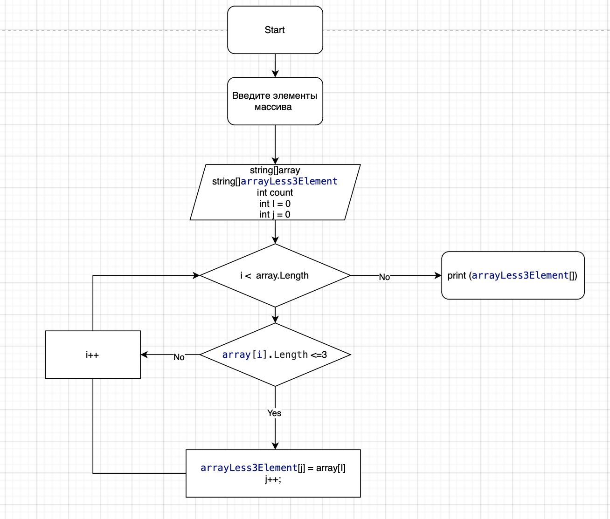

# ExamWork
Для решения данной задачи

1. Создаем массив и печатаем его 

2. Создаем метод, который будет считать количество элементов в массиве, длинна которых меньше 3, чтобы определить длинну массива на выход в конце 

3. Задаем новый массив, в котором будет перекидываться те значения, который меньше 3. Они считаются , пробеганием по заданному массиву и определяя длину

4. Печатаем новый массив

